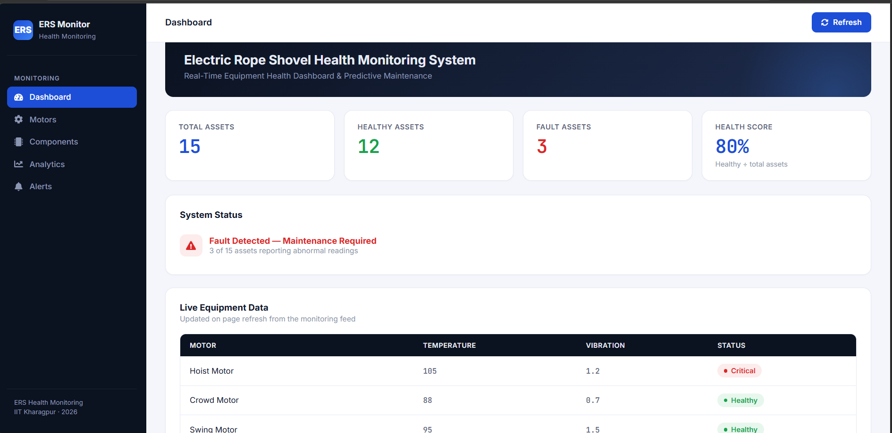
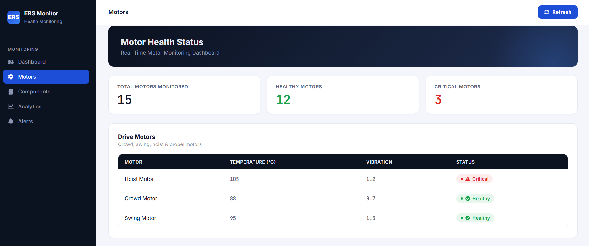
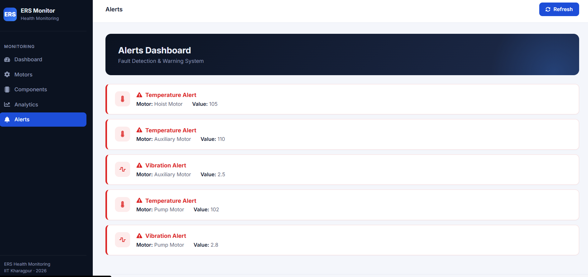

# ERS Health Monitoring System

[


](https://ers-health-monitoring.vercel.app)
[


](https://reactjs.org/)
[


](https://fastapi.tiangolo.com/)
[


](https://www.python.org/)
[


](https://vercel.com/)
[


](https://render.com/)
[


]()

🔗 **Live Demo:** https://ers-health-monitoring.vercel.app

---

## Overview

ERS Health Monitoring System is a full-stack, real-time web application built to monitor the health and operational status of **Electric Rope Shovels (ERS)** — heavy equipment used in open-pit mining. The system continuously analyzes sensor data (temperature, vibration, and current) across **7 drive motors, 22 auxiliary motors, and 7 electrical components**, identifies abnormal operating conditions, and generates real-time alerts to help prevent unplanned equipment failure and reduce maintenance downtime.

This project was developed as part of a summer internship focused on industrial motor diagnostics and predictive maintenance for heavy machinery.

## Problem It Solves

Unplanned failures in mining equipment like Electric Rope Shovels lead to significant downtime and maintenance costs. This system provides operators with a live dashboard to catch early warning signs — using a simple, interpretable fault rule (**Temperature > 100°C OR Vibration > 2 mm/s → Critical**) — instead of relying on manual inspection schedules.

## Screenshots











## Features

- 📊 Asset health monitoring dashboard
- 🌡️ Temperature and vibration analysis
- 🚨 Real-time alert generation
- 📁 Data upload and processing
- 📈 Interactive analytics and visualization
- ⚙️ Equipment status tracking (7 drive motors, 22 auxiliary motors, 7 components)
- 💻 User-friendly, responsive interface

## Technology Stack

**Frontend:** React.js, JavaScript, HTML, CSS (deployed on Vercel)
**Backend:** FastAPI (Python), Pandas (deployed on Render)
**Data Storage:** CSV-based storage (`data.csv`)

## Architecture

```
Sensor Data (CSV) → FastAPI Backend (Pandas processing) → REST API
→ React Frontend (Recharts visualization) → Real-time Dashboard & Alerts
```

## API Endpoints

| Method | Endpoint      | Description                            |
|--------|---------------|------------------------------------------|
| GET    | `/motors`     | Returns health data for all motors        |
| GET    | `/components` | Returns health data for all components    |
| GET    | `/alerts`     | Returns active critical/warning alerts    |
| POST   | `/upload`     | Uploads new sensor data (CSV)             |
| GET    | `/analytics`  | Returns aggregated data for charts        |

## Project Structure

```
ERS-Health-Monitoring/
├── backend/
│   ├── main.py
│   └── database/
│       └── data.csv
├── frontend/
│   ├── src/
│   │   ├── pages/
│   │   │   ├── Dashboard.js
│   │   │   ├── Motors.js
│   │   │   ├── Components.js
│   │   │   ├── Analytics.js
│   │   │   ├── Alerts.js
│   │   │   └── UploadData.js
│   │   └── App.js
│   └── public/
└── README.md
```

## Functional Modules

**Dashboard** — Displays overall asset health information and system statistics.

**Upload Data** — Allows users to upload equipment sensor data for analysis.

**Components Monitoring** — Tracks the condition of individual equipment components.

**Motors Monitoring** — Monitors motor performance using temperature and vibration readings.

**Analytics** — Provides charts and visual insights from collected data.

**Alerts** — Generates alerts when abnormal operating conditions are detected (Temperature > 100°C or Vibration > 2 mm/s).

## How to Run Locally

**Backend**

```
cd backend
pip install -r requirements.txt
uvicorn main:app --reload
```

**Frontend**

```
cd frontend
npm install
npm start
```

## Deployment

- **Frontend:** Deployed on [Vercel](https://vercel.com/) → https://ers-health-monitoring.vercel.app
- **Backend:** Deployed on [Render](https://render.com/)

## Future Enhancements

- Machine Learning based predictive maintenance
- Database integration (MySQL/PostgreSQL)
- User authentication
- Cloud deployment (expanded)
- Email and SMS alerts
- Advanced analytics dashboard

## Author

**Satyush Mohapatra**
B.Tech — Computer Science and Engineering
KIIT University

## License

This project is developed for educational and academic purposes.
